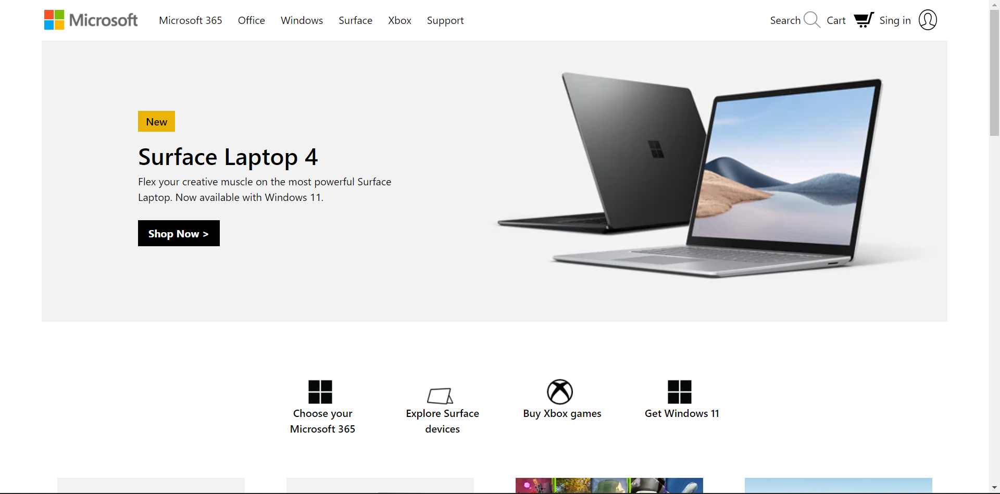

<h1 align = "center">Microsoft_Website_Clone</h1>
<div align="center">
    
</div>

</div>
<div align="center">
    
    
    
    
</div>

## About The Project

Microsoft_Website_Clone is a clone web-page of Microsofts's own website. I use HTML, Tailwind CSS and
JavaScript to make this web page. The web-page is interactive and Rsponsive.

## Built With

All Tech Stacks that are using in this project:

-   HTML5
-   CSS3 | Tailwind CSS
-   Javascript 
-   SVG

## Folder Structure

```
├── Microsoft_Clone
    ├── assets/                  Contains CSS,Logos,Svgs and Importants images.
    ├── js/                      Contains all JavaScript files.      
    ├── photos/                  Contains some minor photos     
    ├── index.html/                       
```

## Responsiveness

<p align="center">
    
</p>

## Deployment

Visit https://microsoft-clone-polarizz17.netlify.app/ to see the deployed website.
